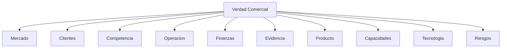

# Research OS

## Ficha de Trazabilidad

- ID: DOC-006
- Estado: Active
- Tipo: Research Operating System
- Objetivo: Gobernar la adquisicion de conocimiento de Fase 0 y convertir incertidumbre en evidencia, insight y decision.
- Entradas:
  - Preguntas abiertas
  - Hipotesis estrategicas
  - Señales de negocio
  - Fuentes internas y externas
- Salidas:
  - Investigaciones
  - Datos
  - Evidencia
  - Hallazgos
  - Insights
  - Decisiones habilitadas
- Dependencias:
  - KM-001 (99_META/KNOWLEDGE_MODEL.md)
  - KG-001 (99_META/KNOWLEDGE_GRAPH.md)
  - RL-001 (02_VERDAD_COMERCIAL/RESEARCH_LEDGER.md)
- Documentos consumidos:
  - DOC-002 (00_MASTER_PLAN/MASTER_PLAN_PICC_NEXT_V3.md)
  - DOC-010 (02_VERDAD_COMERCIAL/Verdad_Comercial.md)
- Documentos generados:
  - RL-001 (02_VERDAD_COMERCIAL/RESEARCH_LEDGER.md)
  - DOC-010 (02_VERDAD_COMERCIAL/Verdad_Comercial.md)
- Responsable: Direccion Comercial + Producto
- Fecha: 2026-07-15
- Dominio SSOT: research
- Version: v2.0
- Criterios de aceptación:
  - Cada investigacion tiene owner, estado, fuentes, evidencia, insight y decision habilitada
  - No se inventan datos
  - Toda pregunta deriva en investigacion o se elimina

## Principio operativo

No respondemos preguntas sueltas.
Diseñamos investigaciones que produzcan decisiones.

## Ciclo de vida canonico

Investigacion -> Hipotesis -> Fuentes -> Plan de obtencion -> Dato -> Validacion -> Insight -> Decision -> Documento impactado -> Estado

## Arbol de investigacion

## Categorias permitidas

- Investigacion Estrategica
- Investigacion Comercial
- Investigacion Financiera
- Investigacion Operativa
- Investigacion Tecnica
- Investigacion Producto
- Investigacion Mercado
- Investigacion Competencia
- Investigacion Legal
- Investigacion Cliente
- Investigacion Evidencia

## Reglas de gobierno

1. Ninguna decision estrategica nueva sin investigacion asociada.
2. Ninguna investigacion sin owner, prioridad, costo, tiempo y estado.
3. Si una pregunta no cambia una decision, se fusiona o elimina.
4. Si una respuesta no tiene fuente verificable, el estado es Sin informacion.
5. Si la evidencia es parcial, el estado es Parcialmente respondida.
6. El Research OS alimenta Verdad Comercial, Modelo Comercial, Trust Architecture, Capability Model, Roadmap y Governance.

## Queue inicial de investigaciones

Ver RL-001 (02_VERDAD_COMERCIAL/RESEARCH_LEDGER.md) como SSOT operacional.

## Auditoria de conocimiento

- Confirmado: el sistema necesita evidencia trazable antes de ampliar capacidades.
- Parcial: existen hipótesis estrategicas pero no medicion suficiente.
- Inexistente: no hay fuentes de negocio accesibles en el repo visible para la mayoria de las preguntas.
- Supuesto: varias decisiones comerciales hoy dependen de intuicion y no de dato duro.

## Notas de implementación minima

Operamos inicialmente con Markdown, YAML, tablas, IDs permanentes, relaciones explícitas, ledgers e indices.
No se crea tecnologia de grafo aun.
