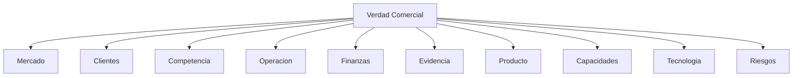

# Research OS

## Ficha de Trazabilidad

- ID: DOC-006
- Estado: Aprobado
- Tipo: Research Operating System
- Objetivo: Gobernar la adquisicion de conocimiento de Fase 0 y convertir incertidumbre en evidencia, insight y decision.
- Entradas:
  - Preguntas abiertas
  - Hipotesis estrategicas
  - Señales de negocio
  - Fuentes internas y externas
- Salidas:
  - Investigaciones
  - Datos
  - Evidencia
  - Hallazgos
  - Insights
  - Decisiones habilitadas
- Dependencias:
  - KM-001 (99_META/KNOWLEDGE_MODEL.md)
  - KG-001 (99_META/KNOWLEDGE_GRAPH.md)
  - RL-001 (02_VERDAD_COMERCIAL/RESEARCH_LEDGER.md)
- Documentos consumidos:
  - DOC-002 (00_MASTER_PLAN/MASTER_PLAN_PICC_NEXT_V3.md)
  - DOC-010 (02_VERDAD_COMERCIAL/Verdad_Comercial.md)
- Documentos indexados:
  - RL-001 (02_VERDAD_COMERCIAL/RESEARCH_LEDGER.md)
  - DOC-010 (02_VERDAD_COMERCIAL/Verdad_Comercial.md)
- Responsable: Direccion Comercial + Producto
- Fecha: 2026-07-15
- Dominio SSOT: research.governance
- Version: v2.0
- Criterios de aceptación:
  - Cada investigacion tiene owner, estado, fuentes, evidencia, insight y decision habilitada
  - No se inventan datos
  - Toda pregunta deriva en investigacion o se elimina

## Principio operativo

No respondemos preguntas sueltas.
Diseñamos investigaciones que produzcan decisiones.

## Proposito de etapa

El Research OS existe para alimentar el PICC NEXT Growth System con aprendizaje verificable que fortalezca capacidades comerciales y competitivas.

## Principio rector de inteligencia comercial

Toda investigacion debe responder primero:

Que decision importante del comprador estamos ayudando a tomar?

Si un RID no reduce incertidumbre en una decision de compra relevante, no es prioritario.

## Principio de investigacion por hipotesis

El motor no investiga evidencia aislada; investiga hipotesis estrategicas.

Toda investigacion debe declarar:
- hipotesis estrategica,
- hipotesis alternativa,
- evidencia necesaria para confirmar o refutar,
- criterio de decision.

## Ciclo de vida canonico

Investigacion -> Hipotesis -> Fuentes -> Plan de obtencion -> Dato -> Validacion -> Insight -> Decision -> Documento impactado -> Estado

## Arbol de investigacion

## Categorias permitidas

- Investigacion Estrategica
- Investigacion Comercial
- Investigacion Financiera
- Investigacion Operativa
- Investigacion Tecnica
- Investigacion Producto
- Investigacion Mercado
- Investigacion Competencia
- Investigacion Legal
- Investigacion Cliente
- Investigacion Evidencia

## Reglas de gobierno

1. Ninguna decision estrategica nueva sin investigacion asociada.
2. Ninguna investigacion sin owner, prioridad, costo, tiempo y estado.
3. Si una pregunta no cambia una decision, se fusiona o elimina.
4. Si una respuesta no tiene fuente verificable, el estado es Sin informacion.
5. Si la evidencia es parcial, el estado es Parcialmente respondida.
6. El Research OS alimenta Verdad Comercial, Modelo Comercial, Trust Architecture, Capability Model, Roadmap y Governance.

## Estandar metodologico transversal (Sprint 0)

Este estandar aplica a todo RID presente y futuro.

### Condicion de terminado real

Una investigacion solo se considera terminada si completa, con evidencia trazable, este flujo:

Pregunta -> Hipotesis -> Obtencion de evidencia -> Validacion -> Hallazgos -> Insight -> Decision recomendada -> Capacidad impactada -> Documentos afectados -> Backlog generado

Si falta un elemento, el RID permanece abierto.

### Que constituye evidencia valida

- Fuente identificable (origen, fecha, responsable).
- Trazabilidad a documento o sistema verificable.
- Integridad minima (sin alteracion aparente o con rastro de transformacion).
- Relevancia directa para la pregunta investigada.
- Posibilidad de verificacion por tercero.

### Nivel de confianza

- Alto: evidencia primaria + verificacion cruzada + trazabilidad completa.
- Medio: evidencia parcial o secundaria, con validacion incompleta.
- Bajo: evidencia incompleta, no verificable o dependiente de supuestos.

### Taxonomia operacional

- Dato: observacion puntual sin interpretar.
- Evidencia: dato validado y trazable.
- Hallazgo: patron o brecha derivada de evidencias.
- Insight: interpretacion util para decidir.
- Decision: accion recomendada con owner y capacidad impactada.

### Requisitos minimos de un hallazgo aceptable

- Basado en evidencia trazable.
- Expresa impacto y riesgo.
- Identifica capacidad afectada.
- Propone recomendacion accionable.
- Indica documento a actualizar y backlog derivado.

### Cuando una recomendacion es accionable

- Tiene owner explicito.
- Tiene prioridad (P0/P1/P2).
- Tiene criterio de salida verificable.
- Se vincula a una capacidad del negocio.

### Identificacion de capacidad impactada

La capacidad impactada debe describirse como habilidad operativa del negocio que mejora su desempeño comercial (por ejemplo: venta consultiva basada en evidencia, posicionamiento competitivo verificable, conversion del canal digital).

### Criterio de valor generado

Una investigacion genero valor cuando habilita al menos una decision ejecutable que fortalece capacidad comercial y actualiza artefactos de gobernanza o verdad comercial con evidencia verificable.

### Institucionalizacion del aprendizaje

Todo cierre de investigacion debe declarar si genera:
- doctrina,
- estandar,
- playbook,
- regla de operacion,
- actualizacion de capacidad,
- o conocimiento historico.

El aprendizaje no termina al cerrar la investigacion; se institucionaliza.

## Evolucion metodologica: de Claim-Evidence Readiness a Decision Readiness

- Enfoque anterior: evaluar si un claim es publicable.
- Enfoque actual: evaluar si una superficie comercial habilita decisiones de compra con evidencia verificable.

Unidad de analisis operativa:
- Decision de compra por ICP y etapa del journey.

Pregunta central de evaluacion:
- Este mensaje reduce incertidumbre del comprador y lo ayuda a avanzar de etapa?

Salida esperada:
- Decisiones habilitadas, decisiones bloqueadas y vacios de confianza priorizados.

## Decision Surface (clasificacion de trabajo)

Decision Surface = cualquier superficie publica o comercial de PICC que influye decisiones del comprador.

Ejemplos: Home, casos, propuestas, PDFs, reportes, presentaciones, landing pages, herramientas, LinkedIn.

Todas deben evaluarse con la misma metodologia de Decision Readiness.

## Indicador estrategico: Decision Coverage

Definicion:
- Porcentaje de decisiones criticas del comprador correctamente soportadas por evidencia en una Decision Surface.

Formula:
- Decision Coverage (%) = (Decisiones criticas soportadas / Total de decisiones criticas evaluadas) x 100

Criterio de decision soportada:
- Existe mensaje explicito para la decision.
- Existe evidencia trazable con confianza media o alta.
- Existe owner responsable de vigencia de evidencia.
- Existe accion definida (mantener, fortalecer, reescribir, eliminar o priorizar).

## Indicadores de acumulacion estrategica

Se integran como indicadores conceptuales para futuras fases:
- Advantage Velocity.
- Knowledge Reuse Ratio.
- Evidence Leverage.
- Competitive Gap Reduction.
- Capability Compound Rate.

## Gates de decision (separacion obligatoria)

Toda evaluacion de avance de un RID debe emitir dos gates independientes:

- Gate A - Validacion metodologica:
  - Evalua solo metodologia, flujo, criterios, entregables, gobernanza y reproducibilidad.
  - Resultado permitido: GO / NO GO.
- Gate B - Readiness operativo:
  - Evalua solo fuentes, accesos, evidencia primaria, permisos y datos necesarios para ejecutar.
  - Resultado permitido: GO / GO CONDICIONADO / NO GO.

Prohibido consolidar Gate A y Gate B en una sola decision global.

## Escala de Readiness operativo (R)

- R0 - No iniciado.
- R1 - Metodo definido.
- R2 - Fuentes identificadas.
- R3 - Accesos validados.
- R4 - Piloto aprobado.
- R5 - Investigacion lista para ejecutar.

Todo RID debe declarar explicitamente su nivel R actual.

## Definition of Ready (DoR)

Una investigacion esta lista para comenzar cuando cumple como minimo:

1. Objetivo aprobado.
2. Owner asignado.
3. Fuentes identificadas.
4. Accesos disponibles.
5. Criterios de aceptacion definidos.
6. Riesgos registrados.

## Definition of Done (DoD)

Una investigacion puede cerrarse cuando demuestra como minimo:

1. Evidencia validada.
2. Hallazgos completos.
3. Decisiones emitidas.
4. Capacidades impactadas identificadas.
5. Documentos actualizados.
6. Backlog generado.

## Queue inicial de investigaciones

Ver RL-001 (02_VERDAD_COMERCIAL/RESEARCH_LEDGER.md) como SSOT operacional.

## Auditoria de conocimiento

- Confirmado: el sistema necesita evidencia trazable antes de ampliar capacidades.
- Parcial: existen hipótesis estrategicas pero no medicion suficiente.
- Inexistente: no hay fuentes de negocio accesibles en el repo visible para la mayoria de las preguntas.
- Supuesto: varias decisiones comerciales hoy dependen de intuicion y no de dato duro.

## Notas de implementación minima

Operamos inicialmente con Markdown, YAML, tablas, IDs permanentes, relaciones explícitas, ledgers e indices.
No se crea tecnologia de grafo aun.
