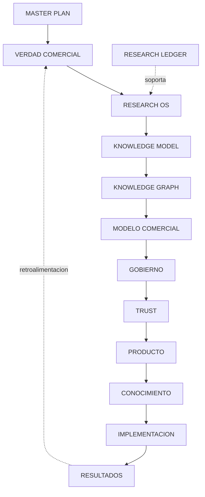

# SYSTEM MAP

## Ficha de Trazabilidad

- ID: DOC-045
- Estado: 🟢 Aprobado
- Tipo: Diagrama + mapa sistémico
- Objetivo: Mostrar la arquitectura completa del repositorio en menos de dos minutos.
- Entradas:
  - DOC-046 (INDEX.md)
  - DOC-006 (02_VERDAD_COMERCIAL/000_PREGUNTAS_ABIERTAS.md)
- Salidas:
  - Visión sistémica navegable por capas
- Dependencias:
  - DOC-044 (99_META/REPOSITORY_RULES.md)
- Documentos consumidos:
  - DOC-002 (00_MASTER_PLAN/MASTER_PLAN_PICC_NEXT_V3.md)
- Documentos visualizados:
  - DOC-046 (INDEX.md)
  - KM-001 (99_META/KNOWLEDGE_MODEL.md)
  - KG-001 (99_META/KNOWLEDGE_GRAPH.md)
  - RL-001 (02_VERDAD_COMERCIAL/RESEARCH_LEDGER.md)
- Responsable: PMO / Arquitectura de conocimiento
- Fecha: 2026-07-15
- Criterios de aceptación:
  - Comprensión end-to-end < 2 minutos



    ## Mapa de continuidad PICC NEXT

    La flecha indica dependencia de lectura/gobernanza y continuidad del programa, no producción automática de un artefacto sobre otro.

    ```mermaid
    flowchart TD
      SHDLS[SHDLS V1.0\ncongelado]
      GS[Growth System V1\ncongelado]
      BS[Buyer System V1\ncongelado]
      DIS[Discovery Intelligence System V1\ncongelado]
      DE[Demand Engine V1\ncongelado]
      KPP[Knowledge Product Portfolio V1\naprobado]
      MKM[Market Knowledge Map V1\naprobado]
      MBM[Market Behavior Map V1\nactivo]
      BCE[Buyer Curiosity Engine V1\naprobado]
      QP[Question Portfolio\nfuturo]
      KP[Knowledge Products\nfuturo]
      GMVP[Growth MVP V1\naprobado]
      PIPE[Pipeline / proyectos / aprendizaje\nactivo]
      ZM[ZEUS Integration Memo\naprobado]
      ZA[ZEUS Assessment V1\naprobado]
      G2[Gate 2 Prep: RiskDiag Pilot V1\nready for ZEUS authorization]

      SHDLS --> GS --> BS --> DIS --> DE --> KPP --> MKM --> MBM --> BCE --> QP --> KP --> GMVP --> PIPE
      PIPE --> ZM --> ZA --> G2

      classDef frozen fill:#e5e7eb,stroke:#6b7280,color:#111827;
      classDef approved fill:#dcfce7,stroke:#16a34a,color:#14532d;
      classDef active fill:#ffedd5,stroke:#f97316,color:#7c2d12;
      classDef future fill:#dbeafe,stroke:#2563eb,color:#1e3a8a;
      classDef ready fill:#fef3c7,stroke:#d97706,color:#78350f;

      class SHDLS,GS,BS,DIS,DE frozen;
      class KPP,MKM,GMVP,BCE,ZM,ZA approved;
      class MBM,PIPE active;
      class QP,KP future;
      class G2 ready;
    ```
